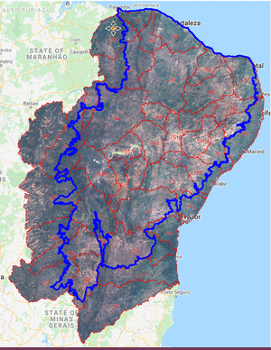
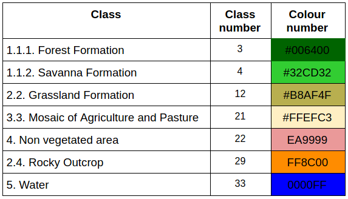
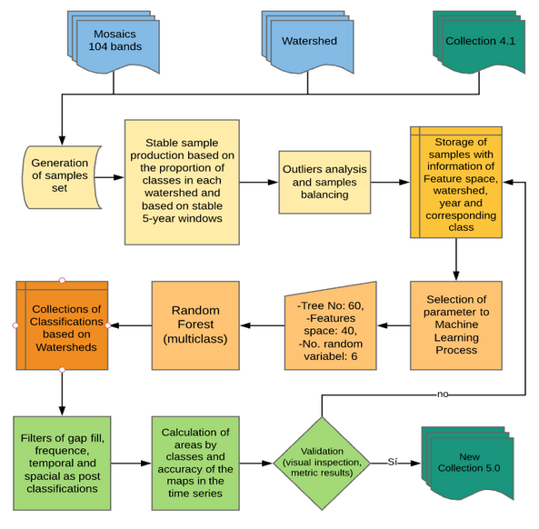

# Mapping methodology of Land Used Land Cover mapping of 35 years on project Mapbiomas/ Biome Caatinga

In this repository we share a set of scripts that were used for the construction of the use and coverage maps of the Caatinga biome in the 5.0 collection of the Mapbiomas project. The Maps were created from the Mapbiomas mosaics. Each mosaic corresponding to a year within the 1985-2019 series was trimmed by the limits of Hydrographic Basins of Brazil at level 2, figure 1. Some hydrographic basins were raised to level 3 in order to facilitate the Google Earth Engine api calculations.

    

Figure 1: Limits of hydrographic basins, mosaics, and one of the maps in collection 5.

The classes produced in this work correspond to level 3, available in:

> https://mapbiomas.org/codigos-de-legenda?cama_set_language=pt-BR

    

Table 1: Legend of the classified classes.

The flow of the mapping process is explained in figure 2 below:

    

Figure 2. Classification process of Mapbiomas current collection (1985-2019) in the Caatinga Biome.

### SUMMARY
* -- collection of training samples
* -- Parameter analysis for Random Forest
* -- Classification of Images Collection with Random Forest
* -- Validation of Results

## Random Forest mapping for large volumes of data

- *The collection of training samples* is divided into 3 important parts:
* - selection of ROIs 
* - removal of puntos outliers

*Reference samples* for classification are collected from the map series in the most recent collection of Mapbiomas. To collect points with a certain level of veracity confidence per map year, a layer of stable pixels with 5 years of maps is created. Two years before the year under study and two years later. The window in time can be enlarged or reduced to 3, but it always matters. For this, modify the input parameters in the dictionary stop in the script pontos_SemBalanceamento.py.

>param = {
>   'bioma': ["CAATINGA",'CERRADO','MATAATLANTICA'],
>   'asset_bacias': 'users/diegocosta/baciasRecticadaCaatinga',
>   'asset_IBGE': 'users/SEEGMapBiomas/bioma_1milhao_uf2015_250mil_IBGE_geo_v4_revisao_pampa_lagoas',  
>   'outAsset': 'projects/mapbiomas-workspace/AMOSTRAS/col5/CAATINGA/ROIsXBaciasBalv2/',
>   'assetMapbiomasP': 'projects/mapbiomas-workspace/public/collection4_1/mapbiomas_collection41_integration_v1',
>   'asset_Mosaic': 'projects/mapbiomas-workspace/MOSAICOS/workspace-c3',
>   'classMapB': [3,4,5,9,12,13,15,18,19,20,21,22,23,24,25,26,29,30,31,32,33],
>   'classNew':  [3,4,3,3,12,12,21,21,21,21,21,22,22,22,22,33,29,22,33,12,33],
>   'janela': 5,
>   'escala': 30,
>}

Modify the file that records the collected basins:
arqFeitos = open("registros/lsBaciasROIsfeitasBalanceadas.txt", 'r')

To collect enough and necessary items for each hydrographic basin, just leave the Tortora method, 1978 in effect, in the input parameters:
> 'metodotortora': True,

