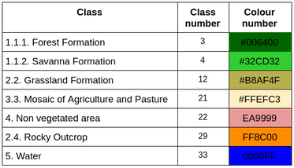

# Mapping methodology of Land Used Land Cover mapping of 35 years on project Mapbiomas/ Biome Caatinga

In this repository we share a set of scripts that were used for the construction of the use and coverage maps of the Caatinga biome in the 5.0 collection of the Mapbiomas project. The Maps were created from the Mapbiomas mosaics. Each mosaic corresponding to a year within the 1985-2019 series was trimmed by the limits of Hydrographic Basins of Brazil at level 2, figure 1. Some hydrographic basins were raised to level 3 in order to facilitate the Google Earth Engine api calculations.


<p align="center">
    
</p>

Figure 1: Limits of hydrographic basins, mosaics, and one of the maps in collection 5.

The classes produced in this work correspond to level 3, available in:

> https://mapbiomas.org/codigos-de-legenda?cama_set_language=pt-BR


<p align="center">
    
</p>

Table 1: Legend of the classified classes.

The flow of the mapping process is explained in figure 2 below:
<p align="center">
    
</p>

Figure 2: Classification process of Mapbiomas current collection (1985-2019) in the Caatinga Biome.

### SUMMARY
* -- collection of training samples
* -- Parameter analysis for Random Forest
* -- Classification of Images Collection with Random Forest
* -- Validation of Results


## Random Forest mapping for large volumes of data

- *The collection of training samples* is divided into 3 important parts:
* - selection of ROIs 
* - removal of puntos outliers

*Reference samples* for classification are collected from the map series in the most recent collection of Mapbiomas. To collect points with a certain level of veracity confidence per map year, a layer of stable pixels with 5 years of maps is created. Two years before the year under study and two years later. The window in time can be enlarged or reduced to 3, but it always matters. For this, modify the input parameters in the dictionary stop in the script pontos_SemBalanceamento.py.
```python
param = {
   'bioma': ["CAATINGA",'CERRADO','MATAATLANTICA'],
   'asset_bacias': 'users/diegocosta/baciasRecticadaCaatinga',
   'asset_IBGE': 'users/SEEGMapBiomas/bioma_1milhao_uf2015_250mil_IBGE_geo_v4_revisao_pampa_lagoas',  
   'outAsset': 'projects/mapbiomas-workspace/AMOSTRAS/col5/CAATINGA/ROIsXBaciasBalv2/',
   'assetMapbiomasP': 'projects/mapbiomas-workspace/public/collection4_1/mapbiomas_collection41_integration_v1',
   'asset_Mosaic': 'projects/mapbiomas-workspace/MOSAICOS/workspace-c3',
   'classMapB': [3,4,5,9,12,13,15,18,19,20,21,22,23,24,25,26,29,30,31,32,33],
   'classNew':  [3,4,3,3,12,12,21,21,21,21,21,22,22,22,22,33,29,22,33,12,33],
   'janela': 5,
   'escala': 30,
}
```

Modify the file that records the collected basins:
arqFeitos = open("registros/lsBaciasROIsfeitasBalanceadas.txt", 'r')

To collect enough and necessary items for each hydrographic basin, just leave the Tortora method, 1978 in effect, in the input parameters:
> 'metodotortora': True,

```javascript
/////////////////////////////////////////////////////////////////////////////////////
/// calculates the number of samples that represent each class well              ////
/// according to the percentage of presence of this class in the basin and the   ////
/// statistical representativeness                                               ////
/// n = z2 * (p * (1-p)) / E2 ===> z = 1.96 ====> E = 0.025 ==> no = 1 / E2      ////
/// n = (B * N * (1-N)) / E2                     Tortora index (1978)            ////
```
> ==> run  :  python  pontos_balanceadosv2.py

to collect a number of equal pixels per class in each of the watershed regions use:

> ==> run: python pontos_SemBalanceamento.py

Remove Outliers is a good technique for cleaning data in the preprocessing step. The outliers pixels of each coverage class are removed using a clustering algorithm “Learning Vector Quantization, LVQ” implemented in the Google Earth Engine of the article KOHONEN, 1998.

> ==> run: python filtroOutlierAmostrasv2.py

<p align="center">
    
</p>
Figure 3: Visualization of the result of removing outliers before and after.

For the construction of the use and coverage maps of the Mapbiomas project, annual analytical mosaics are used. These mosaics have a Feature Space of 104 bands. The selection of the bands to be used in a classification by Machine Learning is fundamental for a good performance of the classification algorithm as well as decreasing the processing time. For this analysis, all points previously collected are downloaded from asset GEE, in CSV format. These have information from each of the bands in the mosaic. The method to know which bands of the mosaic are most important is used the function [feature_importances_] of the model implemented in the python sklearn library, for more information [visit scikit-learn](https://scikit-learn.org/stable/modules/generated/sklearn.ensemble.RandomForestClassifier.html?highlight=sklearn%20ensemble#sklearn.ensemble.RandomForestClassifier):

```python
 ==>  run: python FeatureImportance_RF.py
```
*Selection of random forest parameters by ROC accuracy*
The Random Forest Classifier is trained using bootstrap aggregation, where each constructed tree is adjusted based on a bootstrap sample of the training observations and a random set of size bands fixed in the input parameters. The out-of-bag error (OOB) is the average error for each calculated using predictions from trees that do not contain in their respective bootstrap sample. This allows the Random Forest Classifier to be adjusted and validated during the first training, and to compare with other sets of parameters. In this analysis, the parameter to modify is the number of trees. For this, the paths to the CSV samples must be modified:

<p align="center">
    
</p>
Figure 4: Plot of ROC by max_features parameters.

For more information visit [scikit-learn](https://scikit-learn.org/stable/auto_examples/ensemble/plot_ensemble_oob.html#sphx-glr-auto-examples-ensemble-plot-ensemble-oob-py):

## *Classification of Landsat mosaics with Random Forest*
After selecting the characteristics space, refining the sample set, selecting the parameters to be used for the classification, the next step would be the classification. Change some parameters in the dictionary:
```python
param ={
    'assetOut': 'projects/mapbiomas-workspace/AMOSTRAS/col5/CAATINGA/classificacoes/classesV11/',
    'assetROIs': {'id':'projects/mapbiomas-workspace/AMOSTRAS/col4/CAATINGA/PtosBacias2_1000'},
    'anoInicial': 1985,
    'anoFinal': 2019,
    'pmtRF': {
       'numberOfTrees': 60,
       'variablesPerSplit': 6,
       'minLeafPopulation': 3,
       'maxNodes': 10,
       'seed': 0
    }
}
```
<!-- ''' -->
‘assetROIs’ is a folder within a GEE asset, which stores the sample ee.FeaturesCollection for each hydrographic basin. Each ee.FeaturesCollection has a set of points per year that will be used in the classification.

> == > run:  python classificacao_bacias_final.py

### Validation
Validation of a historical series of maps is a complex process that requires several ways to review the data. In order to generate a one-year map millions of pixels are classified, these classified pixels need a visual inspection and if the experts agree to move on to another step, which is the calculation of the accuracy indexes and analysis of the series of areas by class. The latter analysis helps to detect abrupt errors that could be overlooked in the analyzes per year. If the result of the evaluation is not satisfactory, it is necessary to return to the step of reviewing the parameters, samples and classifying again. The reference points were referenced by the LAPIG / UFG team on the platform developed for this activity (tvi.lapig.iesa.ufg.br), for more information visit the [ATBD of mapbiomas](https://mapbiomas-br-site.s3.amazonaws.com/ATBD_Collection_5_v1.pdf)


#### accuracy calculation
Modify the parameters, data asset and if the map is in Image or ImageCollection format from GEE
```python  
param= {  'assetCol5': 'projec…',
     "amostrarImg": True
}
```
> ==>  run: python getCSVsPointstoAcc.py

all points tables per year will be saved in the "ptosCol5" folder on your google drive. Once you have all the tables saved on your computer, you must change the path in the next script and run.

> ==>  run: python accuracy.py 

#### area calculation by class in each year
The calculation of area by class is calculated for each watershed and stored in a single CSV table. The input parameters to be modified:
```python
param = {
    'inputAsset': 'projects/..'
    classMapB': [3, 4, 5, 9,12,13,15,18,19,20,21,22,23,24,25,26,29,30,31,32,33,36,39,41],
    'classNew': [3, 4, 3, 3,12,12,21,21,21,21,12,22,22,22,22,33,29,22,33,12,33,21,21,21],
    'collection': '5.0',
    'geral':  True,
    'isImg': True, 
    'inBacia': False,
    'version': '-3',
    'sufixo': '_col5_ver_v7v2_2205',
}
```
‘IsImg’:   if the map format that is calculating the area is in ee.Image
'InBacia':   if the map has not yet been mosaic
‘General’:   if you want to calculate the area of the entire caatinga or area of the classes for each hydrographic basin.

This done:
> ==> run: python calculoArea.py


#### graphical visualization of the area and accuracy series

> ==> open R-Studio  run col5.R

### Referencias:
Tortora, R. D. (1978). A note on sample size estimation for multinomial populations. The American Statistician, 32(3), 100-102.
Kohonen, T. (1998). Learning vector quantization, The handbook of brain theory and neural networks.
https://rstudio.com/wp-content/uploads/2015/03/rmarkdown-spanish.pdf

